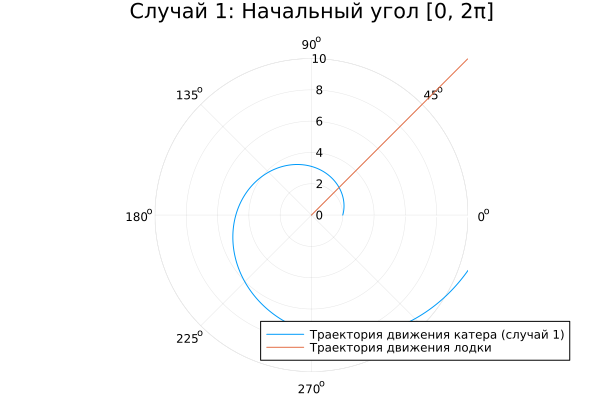
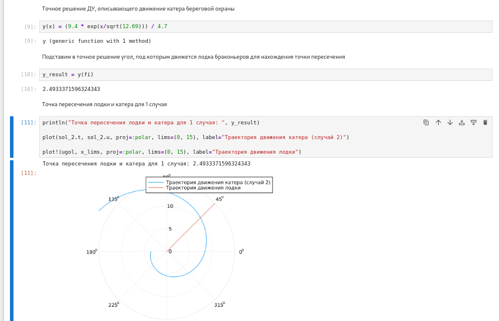
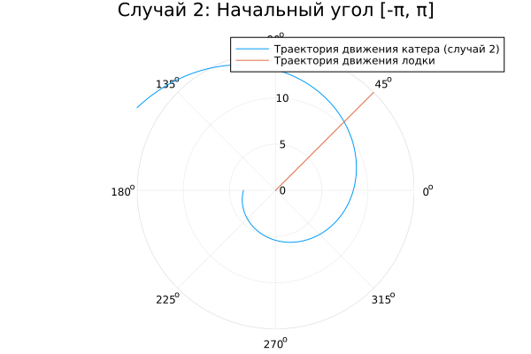
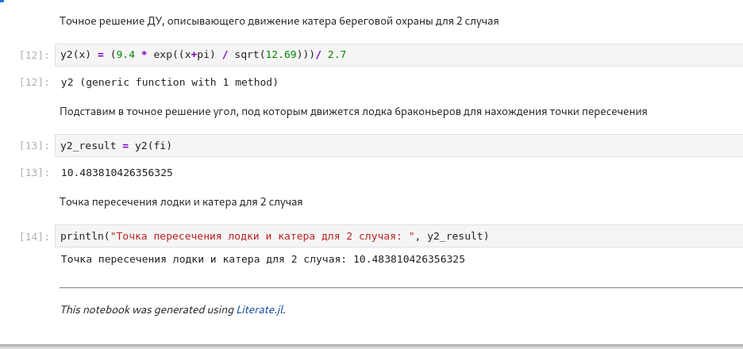

---
## Author
author:
  name: Арбатова Варвара Петровна
  degrees: DSc
  orcid: 0000-0002-0877-7063
  email: 1132236020@rudn.ru
  affiliation:
    - name: Российский университет дружбы народов
      country: Российская Федерация
      postal-code: 1179.48
      city: Москва
      address: ул. Миклухо-Маклая, д. 6
## Title
title: Презентация по лабораторной работе №2
subtitle: Математическое моделирование
license: CC BY
date: today
date-format: "YYYY-MM-DD" # Example: 2025-09-06
---

## Докладчик

  * Арбатова Варвара Петровна
  * студентка
  * группа НКНбд-01-23
  * Российский университет дружбы народов
  * [1132226447@rudn.ru](mailto:1132236020@rudn.ru)
  * <https://github.com/vparbatova>

## Цель работы

Построить математическую модель для выбора правильной стратегии при решении примера задаче о погоне.

## Задание

На море в тумане катер береговой охраны преследует лодку браконьеров.
Через определенный промежуток времени туман рассеивается, и лодка обнаруживается на расстоянии 9.4 км от катера. Затем лодка снова скрывается в тумане и уходит прямолинейно в неизвестном направлении. Известно, что скорость катера в 3.7 раза больше скорости браконьерской лодки.

## Задание

1. Записать уравнение, описывающее движение катера, с начальными условиями для двух случаев (в зависимости от расположения катера относительно лодки в начальный момент времени).

2. Построить траекторию движения катера и лодки для двух случаев.

3. Найти точку пересечения траектории катера и лодки 

## Выполнение лабораторной работы

Формула для выбора варианта: `(1132236020%70)+1` = 21 вариант.

## Выполнение лабораторной работы

$$
\dfrac{x}{v} = \dfrac{k-x}{3.7v} \text{ -- в первом случае}
$$
$$
\dfrac{x}{v} = \dfrac{k+x}{3.7v} \text{ -- во втором}
$$

Отсюда мы найдем два значения $x_1 = \dfrac{9.4}{4.7}$ и $x_2 = \dfrac{9.4}{2.7}$, задачу будем решать для двух случаев.

## Выполнение лабораторной работы

$$v_{\tau} = \sqrt{3.7^2v^2-v^2} = \sqrt{12.69}v$$

Из чего можно вывести:

$$
r\dfrac{d \theta}{dt} = \sqrt{12.69}v
$$

## Выполнение лабораторной работы

Решение исходной задачи сводится к решению системы из двух дифференциальных уравнений:

$$\begin{cases}
&\dfrac{dr}{dt} = v\\
&r\dfrac{d \theta}{dt} = \sqrt{12.69}v
\end{cases}$$

## Выполнение лабораторной работы

С начальными условиями для первого случая:

$$\begin{cases}
&{\theta}_0 = 0\\  \tag{1}
&r_0 = \dfrac{9.4}{4.7}
\end{cases}$$

## Выполнение лабораторной работы

Или для второго:

$$\begin{cases}
&{\theta}_0 = -\pi\\  \tag{2}
&r_0 = \dfrac{9.4}{2.7}
\end{cases}$$

## Выполнение лабораторной работы

Исключая из полученной системы производную по $t$, можно перейти к следующему уравнению:

$$
\dfrac{dr}{d \theta} = \dfrac{r}{\sqrt{15.81}}
$$

## Реализация модели с помощью Julia

```Julia
using DifferentialEquations, Plots

# расстояние от лодки до катера
k = 9.4
# вычисление x для двух случаев
x1 = k/4.7
x2 = k/2.7
# начальные условия для 1 случая
r0 = x1 
theta0 = (0.0, 2*pi) #диапазон значений 
# Начальные условия для 2 случая
r0_2 = x2 
theta0_2 = (-pi, pi)

```

## Реализация модели с помощью Julia

```

fi=pi/4 #угол под которым двигается лодка

x(t) = tan(fi) * t #движение лодки браконьеров

f(r, p, t) = r/sqrt(12.69) #Функция, описывающая движение катера береговой охраны (ДУ)

```

## Реализация модели с помощью Julia

```
# Постановка ДУ с ЗК для 1 случая
prob = ODEProblem(f, r0, theta0) 
sol = solve(prob, saveat=0.01) #шаг для красивой линии

# Постановка ДУ с ЗК для 2 случая
prob_2 = ODEProblem(f, r0_2, theta0_2)
sol_2 = solve(prob_2, saveat=0.01)

#построим траекторию движения лодки 
ugol = [fi for i in range(0, 15)] #20 т.к. ограничение радиуса полярных координат 20 
x_lims = [x(i) for i in range(0, 15)]
```

## Построение траекторий в первом случае

Построим траекторию движения катера и лодки в первом случае

```Julia
# Отрисовка траектории движения катера
plot(sol.t, sol.u, proj=:polar, lims=(0, 10), label="Траектория движения катера (случай 1)") #передаем время и решение, t - угол
#u - радиус
plot!(ugol, x_lims, proj=:polar, lims=(0, 10), label="Траектория движения лодки")
```

## Построение траекторий в первом случае

{#fig:001 width=70%}

## Точка пересечения в первом случае

$$
r = \frac{9.4}{4.7} e^\frac{\theta}{\sqrt{12.69}} \text{ -- для случая (1)}
$$

```Julia
# Точное решение ДУ, описывающего движение катера береговой охраны
y(x) = (9.4 * exp(x/sqrt(12.69))) / 4.7

# Подставим в точное решение угол, под которым движется лодка браконьеров для нахождения точки пересечения
y_result = y(fi)

# Точка пересечения лодки и катера для 1 случая
println("Точка пересечения лодки и катера для 1 случая: ", y_result)
```

## Точка пересечения в первом случае

{#fig:002 width=70%}

## Построение траекторий во втором случае

```Julia
plot(sol_2.t, sol_2.u, proj=:polar, lims=(0, 15), label="Траектория движения катера (случай 2)")

plot!(ugol, x_lims, proj=:polar, lims=(0, 15), label="Траектория движения лодки")
```

## Построение траекторий во втором случае

{#fig:003 width=70%}


## Точка пересечения во втором случае

```Julia
# Точное решение ДУ, описывающего движение катера береговой охраны для 2 случая
y2(x) = (9.4 * exp((x+pi) / sqrt(12.69)))/ 2.7

# Подставим в точное решение угол, под которым движется лодка браконьеров для нахождения точки пересечения
y2_result = y2(fi)

# Точка пересечения лодки и катера для 2 случая
println("Точка пересечения лодки и катера для 2 случая: ", y2_result)
```

## Точка пересечения в первом случае

{#fig:004 width=70%}


